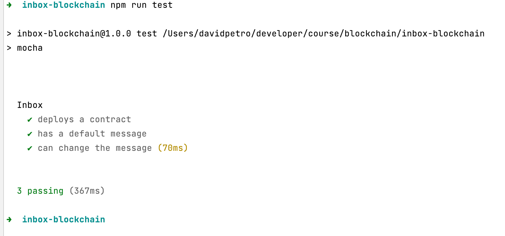
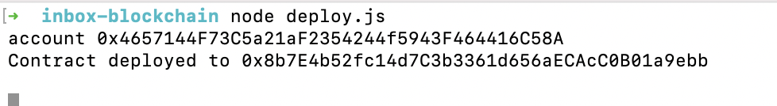
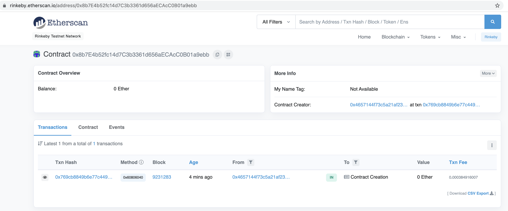

# Inbox-blockchain

### Config deploy

- deploy.js

```
const privateKey = "YOUR_PRIVATE_KEY"
const infuraKey = "YOUR_KEY"
```


### Run test




### Deploy



https://rinkeby.etherscan.io/address/0x8b7e4b52fc14d7c3b3361d656aecacc0b01a9ebb



